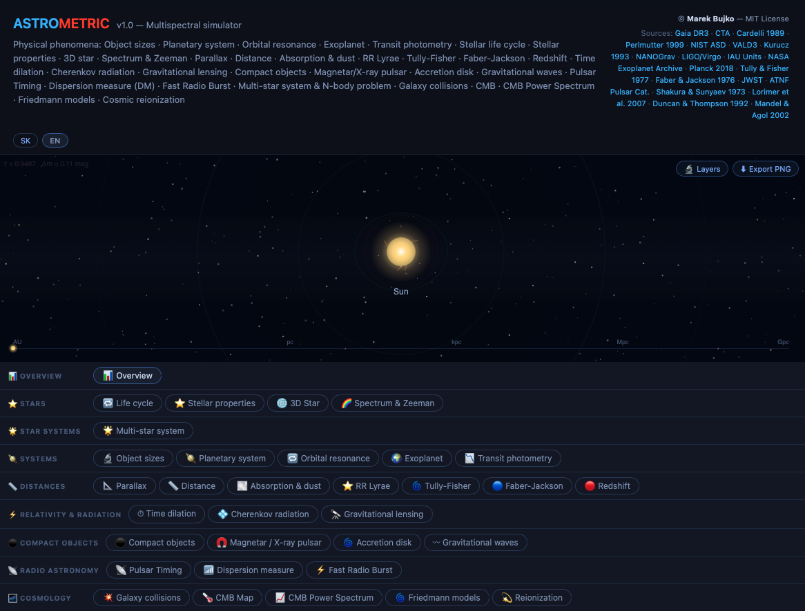

# AstroMetric - Multispectral Simulator

AstroMetric is a comprehensive astro-simulation sandbox
covering: astrophysics, observational methods and cosmology.

<a href="https://marekbujko.github.io/mb-astrometric/" rel="nofollow">
Try AstroMetric v1.0 SK/EN!</a>

